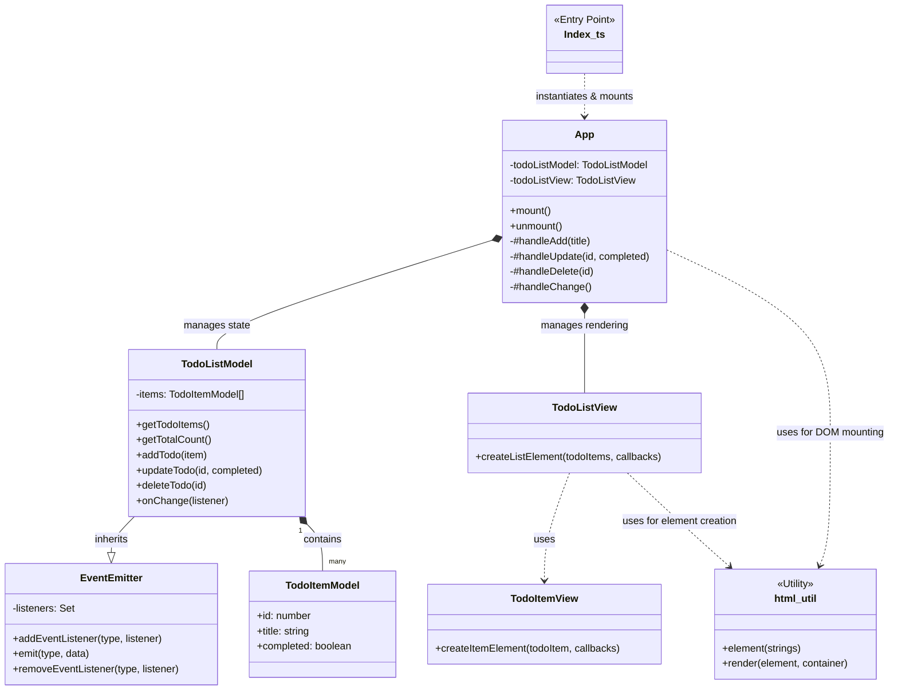
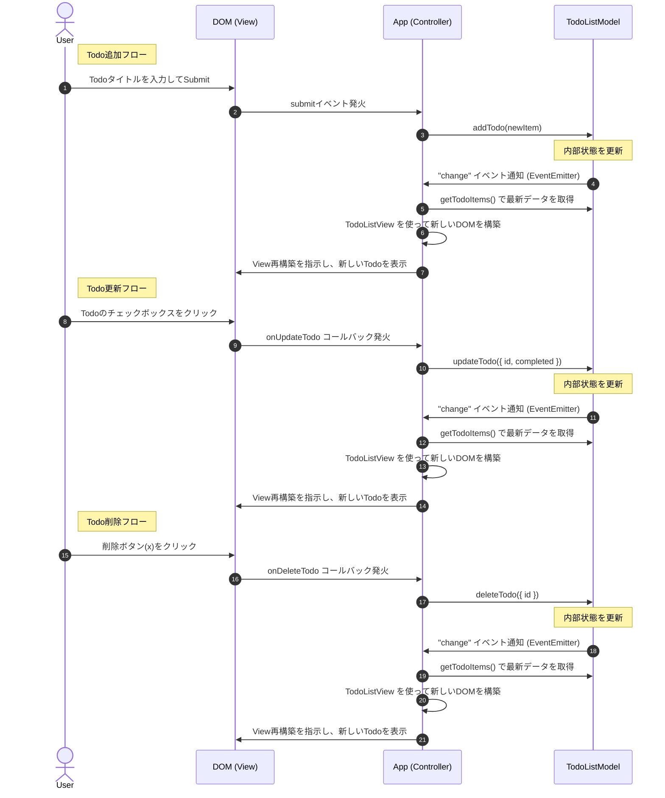

# todo-app-typescript

[Todoアプリ · JavaScript Primer](https://jsprimer.net/use-case/todoapp/) を元に、MVCアーキテクチャで実装したTodoアプリケーションです。

## アーキテクチャ設計

### Model

Modelはアプリケーションのデータとその状態を管理します。以下の2つのクラスで構成されています。

- `TodoItemModel`
  - 個々のTodoアイテムを表現するクラスです。
  - Todoアイテムの状態（例: タイトル、完了状態）を保持します。

- `TodoListModel`
  - Todoアイテムのリストを管理するクラスです。
  - Todoアイテムの追加、削除、更新などの操作を提供します。
  - `EventEmitter`を継承しており、状態の変更を通知する仕組みを持っています。

### View

- `TodoItemView`
  - 単一のTodoアイテムを描画するためのクラスです。

- `TodoListView`
  - Todoリスト全体を描画するためのクラスです。
  - 各Todoアイテムを描画し、リスト全体を管理します。

- `html-util.ts`
  - DOM操作を簡略化するためのユーティリティ関数を提供します。

### Controller

`App`クラスがコントローラとして機能します。以下の役割を持ちます。

- Controllerがユーザー操作(Todo追加、更新、削除)を検知し、Model更新を指示します。
- ControllerがModelの変更イベントを検知し、View再構築(Todoの画面表示)を指示します。

### ファイル構成

```
index.html           # アプリケーションのHTML
package.json         # パッケージ管理ファイル
tsconfig.json        # TypeScript設定ファイル
src/
  index.ts             # エントリーポイント
  App.ts               # コントローラ
  EventEmitter.ts      # イベント通知の仕組み
  model/
    TodoItemModel.ts   # TodoアイテムのModel
    TodoListModel.ts   # TodoリストのModel
  view/
    html-util.ts       # DOM操作ユーティリティ
    TodoItemView.ts    # TodoアイテムのView
    TodoListView.ts    # TodoリストのView
```

### UML図




